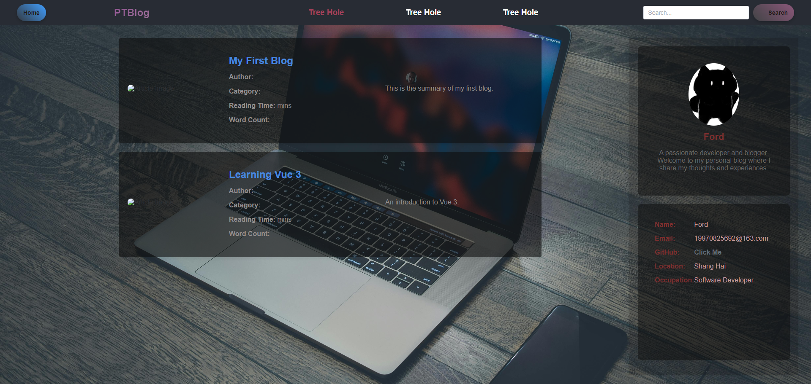
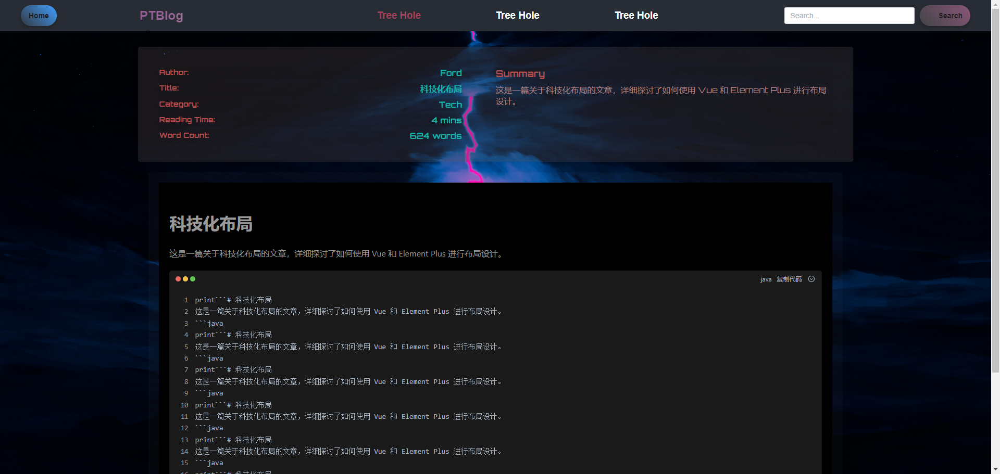
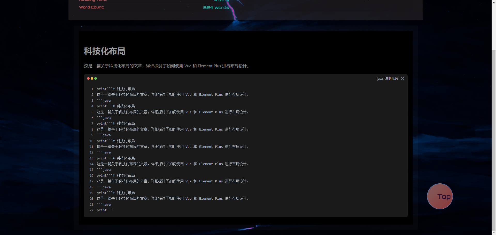
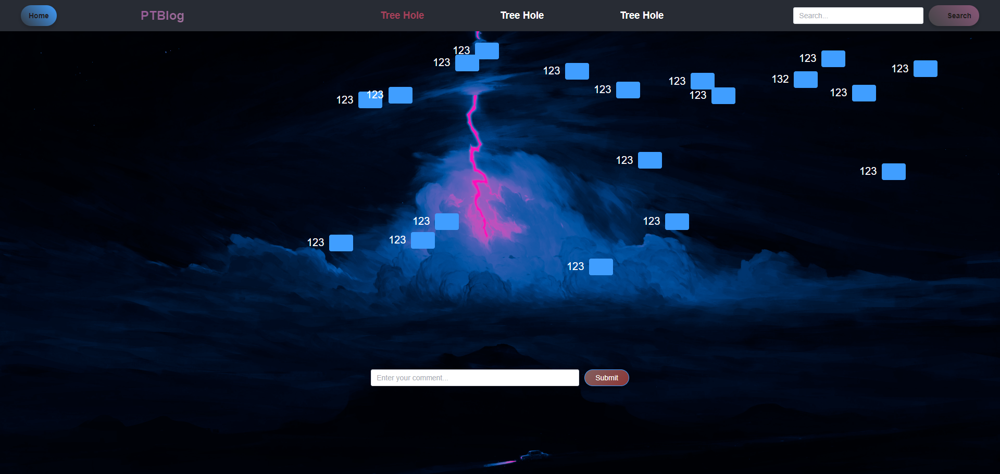

# PTBlog-Vue
## 介绍
PTBlog-Vue 是一个基于 Vue.js 的博客系统，它使用 [Element](https://github.com/ElemeFE/element) 作为 UI 组件库。
这里的页面展示不展示，后续再开放

# my-blog部分页面展示
my-blog作为用户使用的前端，所以页面必须要好看，我没有发后端主页前端的原因就是还有许多功能没有做好，但是已经基本完成，过几天就开源出来。
1.首页

2.文章详情页

往下转动可以看到回到顶端的按钮

**点击Tree Hole 会跳转到树洞页面**

目前正在大步更新，功能会越来越完善。

如有需要目前的网站资源请联系我，Email: 19970825692@163.com

后端暂时还没有开源，前端暂时只开源了部分功能。
后续会逐步开源后端。
尽情期待！