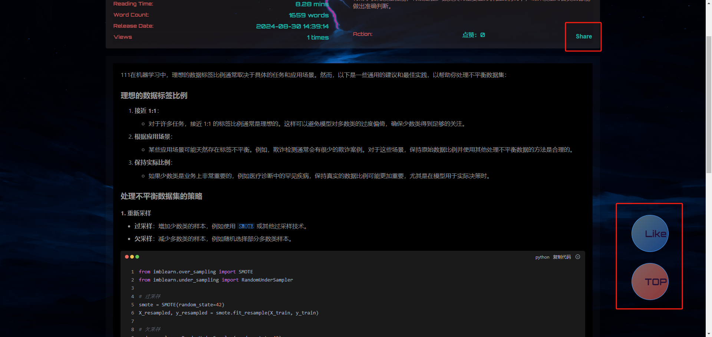

# PTBlog-Vue
## 介绍
PTBlog-Vue 是一个基于 Vue.js 的博客系统，它使用 [Element](https://github.com/ElemeFE/element) 作为 UI 组件库。

前端采用VUE+VITE+ElementUI搭建的后台管理页面，后端采用SpringBoot+Mybatis+Redis+MySQL+nginx+PageHelper+OpenFeign实现。

**后续：**再追加ElasticSearch实现搜索功能，RocketMQ实现延迟发布消息，Redis实现缓存、点赞、评论等功能。

# 注意
vue-pt是后台的前端页面，my-blog是用户使用的前端页面，后端代码都暂时没有上传，因为功能不齐全，暂时只做了部分

# vue-pt部分页面展示
### 主页
目前有几个card不知道放什么就还没完成，后面会慢慢完善

### 用户管理
用户管理的功能基本实现，增删改查，但是还没有做权限控制，后面会慢慢完善

### 文章管理
文章管理包括文章修改和文章发布

#### 文章修改

点击编辑按钮，进入文章修改页面，就在文章管理的下方

#### 文章发布
目前还有一些功能不齐全，例如文章种类，文章标签等，后面会慢慢完善

# my-blog部分页面展示
my-blog作为用户使用的前端，所以页面必须要好看，我没有发后端主页前端的原因就是还有许多功能没有做好，但是已经基本完成，过几天就开源出来。
1.首页

2.文章详情页

往下转动可以看到回到顶端的按钮

**点击Tree Hole 会跳转到树洞页面**

目前正在大步更新，功能会越来越完善。

如有需要目前的网站资源请联系我，Email: 19970825692@163.com

后端暂时还没有开源，前端暂时只开源了部分功能。
后续会逐步开源后端。
尽情期待！