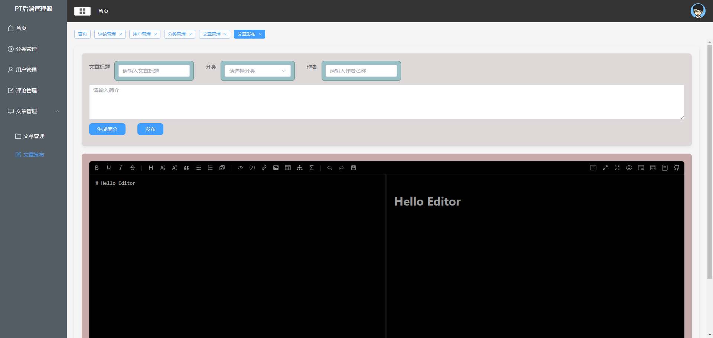

# PTBlog-Vue

# 网站具体地址：http://120.55.90.66:5174/
## 介绍
PTBlog-Vue 是一个基于 Vue.js 的博客系统，它使用 [Element](https://github.com/ElemeFE/element) 作为 UI 组件库。

前端采用VUE+VITE+ElementUI搭建的后台管理页面，后端采用SpringBoot+Mybatis+Redis+MySQL+nginx+PageHelper+OpenFeign实现。

**后续：**再追加ElasticSearch实现搜索功能，RocketMQ实现延迟发布消息，Redis实现缓存、点赞、评论等功能。

# 注意
vue-pt是后台的前端页面，my-blog是用户使用的前端页面，后端代码都暂时没有上传，因为功能不齐全，暂时只做了部分

# vue-pt部分页面展示
### 主页
目前有几个card不知道放什么就还没完成，后面会慢慢完善

### 分类管理
对文章进行了分类，所以需要一个分类管理来管理这些分类

### 用户管理
用户管理的功能基本实现，增删改查，但是还没有做权限控制，后面会慢慢完善

### 评论管理
评论管理只包含了查看和删除功能，后面会慢慢完善，在前端利用AI对评论进行AI识别，如果识别为垃圾评论就删除。

### 文章管理
文章管理包括文章修改和文章发布

#### 文章修改

点击编辑按钮，进入文章修改页面，就在文章管理的下方

#### 文章发布
对文章发布进行了更新，增加了文章分类和标签，并且对文章发布页面进行了优化
还增加了简介功能，调用AI的接口，自动生成简介。

## 后端暂时就是这样的页面，后续再增加

# my-blog部分页面展示
my-blog作为用户使用的前端，所以页面必须要好看，我没有发后端主页前端的原因就是还有许多功能没有做好，但是已经基本完成，过几天就开源出来。
### 首页
对首页进行了优化

### 文章详情页
对文章页面进行了优化，并且增加了点赞功能和分享功能

### 往下转动可以看到回到顶端的按钮，以及点赞按钮，右上角的Share可以对文章进行分享

### 点击Tree Hole 会跳转到树洞页面
会有个人图片展示，这里还没做好，后续会增加分类

#### 点击图片会有放大的效果

### 点击Person
进入到评论页面，可以对文章进行评论，也可以书写自己的生活，分享自己的心事，也可以查看别人的评论

#### 点击别人的评论可以展示详细信息

### 右侧的显示留言板可以对进行评论

#### 不输入则会提示为空，邮箱格式等错误也会提示

#### 胡乱输入内容以及输入不适当言论，AI会识别出来，并提示
随意输入东西，AI会识别出来

输入脏话，AI会识别出来，并提示

目前正在大步更新，功能会越来越完善。

如有需要目前的网站资源请联系我，Email: 19970825692@163.com

后端暂时还没有开源，前端暂时只开源了部分功能。
后续会逐步开源后端。
尽情期待！
